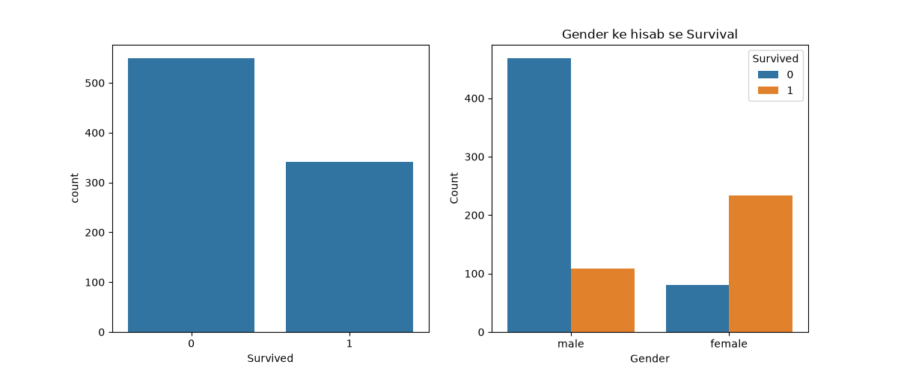

# Titanic Survival - Exploratory Data Analysis

Exploratory data analysis on the Titanic passenger dataset using pandas, matplotlib and seaborn. Built as part of the CodeAlpha Data Analytics internship.

## What This Project Does

- Loads the Titanic dataset (`Titanic-Dataset.csv`)
- Plots how many passengers survived vs did not survive
- Plots survival counts by gender
- Prints dataset shape, column info, missing values and summary statistics

## Files

- `titanic.py` : analysis and charts code
- `Titanic-Dataset.csv` : dataset
- `eda_charts.png` : saved chart output

## Charts

## How to Run

    pip install pandas matplotlib seaborn
    python titanic.py

## Tools Used

Python, pandas, matplotlib, seaborn
